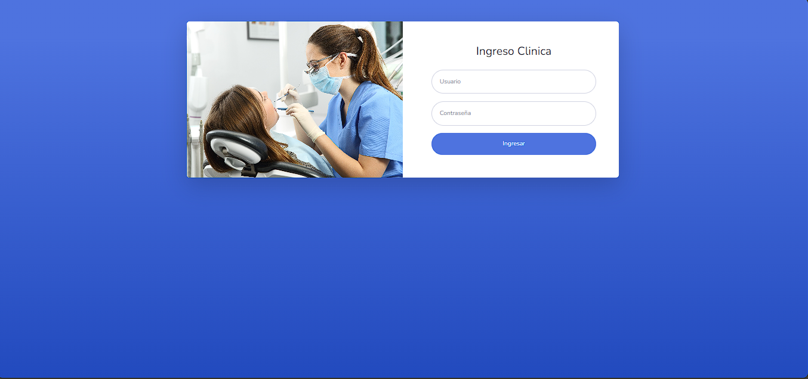
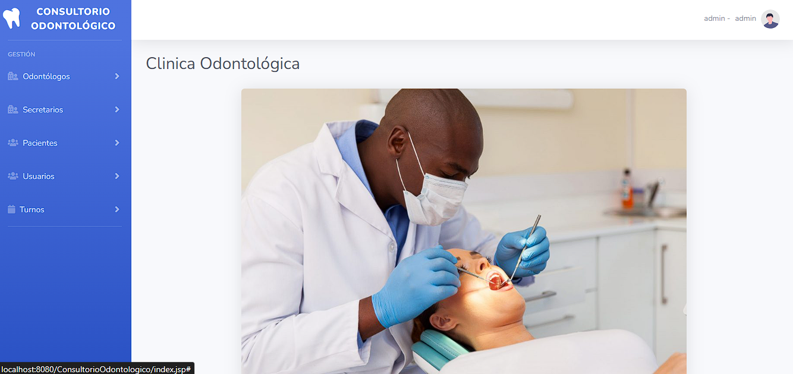
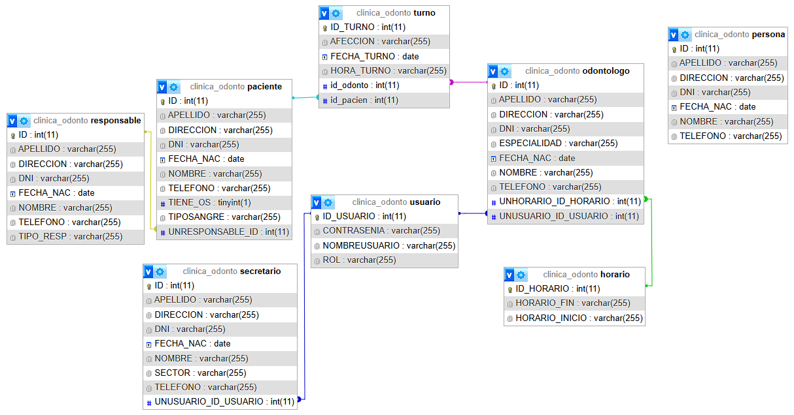

# 🦷 Sistema de Gestión - Consultorio Odontológico


## 📌 Descripción

**Consultorio Odontológico** es un sistema de gestión integral desarrollado en **Java**, diseñado para la administración de clínicas odontológicas. El sistema aplica **control de acceso basado en roles (RBAC)** para garantizar la seguridad de la información y centralizar la organización diaria de pacientes, turnos y profesionales.

Este es un proyecto de **desarrollo personal y carácter práctico**, creado con fines educativos para demostrar sólidos conocimientos en **arquitectura Java EE**, persistencia de datos con **JPA** y gestión de seguridad por niveles. 

> [!IMPORTANT]
> Este sistema no tiene fines comerciales; su objetivo es demostrar mis conocimientos en desarrollo de software y ofrecer una herramienta sencilla para organizar el trabajo diario de la clínica.

---

## Capturas del Sistema

| Pantalla de Login | Panel Principal | Base de Datos (phpMyAdmin) |
| :---: | :---: | :---: |
|  |  |  |

---

## Funcionalidades Principales

- **Autenticación segura**  
  Acceso mediante usuario y contraseña.

- **Protección de rutas y seguridad:**
  - Control de acceso por URL: Si un usuario intenta acceder manualmente a una página que no corresponde a su rol (vía link o historial), el sistema bloquea el acceso y lo redirige, garantizando la integridad de los módulos.

- **Control de acceso por roles**
  - `admin`: acceso total al sistema y gestión de usuarios.
  - `secre`: gestión administrativa de pacientes y turnos.
  - `odonto`: Visualización exclusiva de su propia agenda de turnos (en proceso de refinamiento) y acceso a la lista de pacientes.

- **CRUD Completo de Entidades**
  - Odontólogos, Secretarios, Pacientes, Responsables, Turnos y Usuarios.

- **Gestión de horarios**
  - Definición de jornadas laborales específicas para cada Odontólogo (hora de inicio y fin).

- **Persistencia automática**
  - Creación de tablas en la base de datos mediante JPA al iniciar la aplicación.

---

## Tecnologías Utilizadas

- **Backend:** Java 8 (JDK 1.8)
- **Persistencia:** JPA (EclipseLink 2.7.10)
- **Frontend:** JSP, HTML5, CSS3, JavaScript (Basado en la plantilla SB Admin 2, personalizada y adaptada al flujo del sistema)
- **Base de datos:** MySQL 8.0 (vía XAMPP)
- **Gestor de dependencias:** Maven  
  (gestiona automáticamente el driver MySQL y JPA)
- **Servidor:** Apache Tomcat (recomendado v9.0)

---

## Instalación y Ejecución

### 1️⃣ Clonar el repositorio

```bash
git clone https://github.com/gonzaabenitezz/ConsultorioOdontologico.git
```

### 2️⃣ Configuración de Base de Datos
* Asegúrate de tener **XAMPP** (Apache y MySQL) activo.
* Crea una base de datos vacía llamada: `clinica_odonto`.
* **Nota:** El proyecto está configurado para conectarse con el usuario `root` y sin contraseña. Si tu configuración es distinta, edita el archivo: `src/main/resources/META-INF/persistence.xml`

### 3️⃣ Importación y Despliegue
* Abre tu IDE (**NetBeans**, **IntelliJ** o **Eclipse**).
* Importa el proyecto como **"Maven Project"**.
* Espera a que el IDE descargue las dependencias listadas en el `pom.xml`.
* Haz clic derecho sobre el proyecto y selecciona **Run**.

### 4️⃣ Primer Acceso (Usuario Administrador)
Al ejecutar el proyecto por primera vez, **JPA** creará automáticamente todas las tablas. Para ingresar, debes crear manualmente un usuario administrador en tu consola de **phpMyAdmin**:

```sql
INSERT INTO usuario (ID_USUARIO, CONTRASENIA, NOMBREUSUARIO, ROL) 
VALUES (NULL, 'admin123', 'admin', 'admin');
```

---

### 📂 Estructura del Proyecto

* **`src/main/java/logica`**: Contiene las clases de entidad y modelos de dominio.
* **`src/main/java/servlets`**: Controladores que manejan las peticiones HTTP y la lógica de navegación.
* **`src/main/java/persistencia`**: Controladores de JPA, DAOs y la lógica de acceso a datos.
* **`src/main/resources/META-INF`**: Configuración de la unidad de persistencia (`persistence.xml`).
* **`src/main/webapp`**: Interfaz de usuario (Vistas JSP), estilos CSS y scripts de JavaScript.

---

### Mejoras Pendientes

- [ ] **Encriptación de contraseñas:** Implementar seguridad con BCrypt.
- [ ] **Filtro de turnos:** Refinar la lógica para que cada odontólogo visualice únicamente su agenda personal.
- [ ] **Perfil de usuario:** Creación de un panel para que el usuario gestione sus datos personales.
- [ ] **Optimización de UI/UX:** Mejorar la interfaz para que sea más moderna y ágil. Optimizar formularios y tablas para evitar desplazamientos (scroll) innecesarios y facilitar la carga de datos en una sola vista.
      
---

### Créditos

Proyecto personal de desarrollo y aprendizaje continuo.

**Autor:** [Gonzalo Benitez](https://github.com/gonzaabenitezz)
